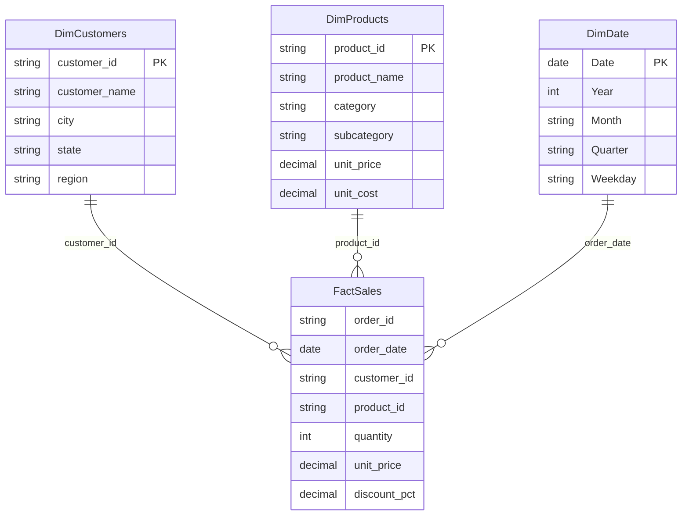

# 🛒 Brazilian E-Commerce Sales Dashboard — Power BI

End-to-end Business Intelligence project: from raw data generation to a fully
modeled Power BI semantic model with DAX measures, built and versioned with
the modern **Power BI Project (`.pbip`) format** so every part of the model is
readable code on GitHub.

> 📸 *Dashboard screenshots go in [`docs/screenshots/`](docs/screenshots/).*

## What this project demonstrates

| Skill | Where |
|---|---|
| Data generation / ETL thinking | [`data/generate_data.py`](data/generate_data.py) — reproducible synthetic dataset with seasonality (Black Friday, Christmas), YoY growth and Brazilian geography |
| Power Query (M) | Parameterized CSV ingestion with typed columns — [`FactSales.tmdl`](EcommerceSales.SemanticModel/definition/tables/FactSales.tmdl) |
| Dimensional modeling | Star schema: 1 fact table + 3 dimensions, single-direction 1:* relationships |
| DAX | 12 documented measures incl. time intelligence (YTD, YoY) — [`_Measures.tmdl`](EcommerceSales.SemanticModel/definition/tables/_Measures.tmdl) |
| BI engineering practices | `.pbip` + TMDL source control, dedicated measure table, marked date table, hidden sort/key columns, data categories for maps |

## Data model (star schema)



- **FactSales** — 31k order lines (Jan 2024 → Jun 2026)
- **DimDate** is a DAX calculated table (`CALENDAR` + `ADDCOLUMNS`), marked as
  the official date table so time intelligence works correctly
- **_Measures** is a dedicated, empty table that groups all KPIs in one place

## Key DAX measures

```dax
Total Sales =
SUMX (
    FactSales,
    FactSales[quantity] * FactSales[unit_price] * ( 1 - FactSales[discount_pct] )
)
```

```dax
Sales YoY % =
VAR SalesLY = CALCULATE ( [Total Sales], DATEADD ( DimDate[Date], -1, YEAR ) )
RETURN
    DIVIDE ( [Total Sales] - SalesLY, SalesLY )
```

All 12 measures (revenue, cost, margin, orders, average ticket, active
customers, YTD, YoY, discounts) are documented with comments in
[`_Measures.tmdl`](EcommerceSales.SemanticModel/definition/tables/_Measures.tmdl).

## How to open it

1. Install [Power BI Desktop](https://powerbi.microsoft.com/desktop/) (free).
2. Clone this repository.
3. Open **`EcommerceSales.pbip`** in Power BI Desktop.
4. Go to **Transform data ▸ Edit parameters** and set `DataFolderPath` to the
   full path of the `data` folder on your machine
   (e.g. `C:\Users\you\BI\data`), then **Refresh**.
5. (Optional) Regenerate the dataset: `python data/generate_data.py`.

## Repository structure

```
├── data/
│   ├── generate_data.py        # reproducible data generator (std-lib only)
│   ├── fact_sales.csv          # 31k order lines
│   ├── dim_customers.csv       # 1.5k customers across all Brazilian regions
│   └── dim_products.csv        # 63 products in 6 categories
├── EcommerceSales.pbip         # open this file in Power BI Desktop
├── EcommerceSales.SemanticModel/
│   └── definition/             # the whole model as TMDL code
│       ├── tables/             # FactSales, dimensions, _Measures (DAX)
│       ├── relationships.tmdl  # star-schema relationships
│       └── expressions.tmdl    # DataFolderPath parameter
├── EcommerceSales.Report/      # report definition
└── docs/screenshots/           # dashboard screenshots
```

## Business questions the dashboard answers

- How is revenue trending month over month, and how does it compare to last year?
- Which product categories and regions drive revenue and margin?
- What is the impact of Black Friday discounting on margin?
- What is the average ticket (ticket médio) and how many customers are active?

---

*Built by Lukas.*
